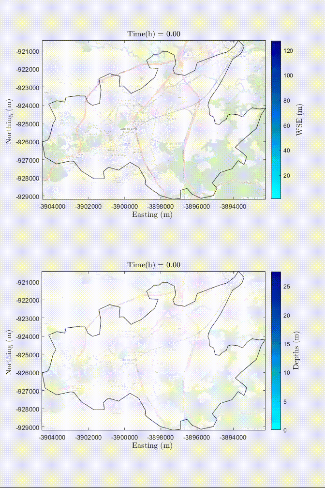

# HydroPol2D: Distributed 2D Hydrologic-Hydrodynamic and Water Quality Model

HydroPol2D is an open-source, high-resolution 2D model built in MATLAB for simulating overland flow, infiltration, groundwater-surface water interactions, and pollutant transport. Developed with performance and flexibility in mind, it supports both CPU and GPU computations and can handle diverse forcing conditions such as spatially distributed rainfall, satellite-derived precipitation, design storms, and hydrograph inputs.

The model is particularly suited for urban, peri-urban, and rural catchments in both gauged and data-scarce regions.

---

## 🌊 Key Features

- **2D overland flow** using Cellular Automata or Local Inertial formulations (default)
- **Fully distributed infiltration** with Green-Ampt formulation and subgrid corrections
- **Groundwater recharge and shallow aquifer flow** via a 2D Boussinesq approach
- **Flexible rainfall input**: gauges, satellite, interpolated, synthetic hyetographs
- **Snow accumulation and melt** with mass balance tracking
- **Dynamic reservoir and dam-break modeling**
- **Pollutant simulation**: 1 pollutant per simulation with build-up/wash-off dynamics
- **Digital twin & forecasting** using real-time inputs (e.g., HADS, ANA)
- **Mass-conserving adaptive time stepping** (Courant-based)
- **Output visualizations** in `.tif`, `.mp4`, `.csv`, `.pdf`, and `.png`

---

## 🖥 Installation & Dependencies

### MATLAB Requirements:
- MATLAB R2020a or newer
- Required Toolboxes:
  - Mapping Toolbox
  - Parallel Computing Toolbox (for GPU mode)

### Recommended:
- NVIDIA GPU with at least 2 GB VRAM and compute capability > 3.5
- 8+ GB RAM for CPU mode

### External Tools:
- **Microsoft Excel** (for parameter configuration)
- **QGIS, Google Earth Engine, or R** for raster preprocessing (DEM, LULC, soils, etc.)

---

Example of a rain-on-the-grid simulation of a 1 in 50-year rainfall in an urban area with influence of urban drainage - Sao Paulo, Brazil.

<p align="center">
  
</p>


Example of a total dam-break collapse scenario in a city in Pernambuco, Northeast - Brazil. 

<p align="center">
  
</p>


## 📂 Input Data Structure

HydroPol2D requires:
- **General Setup File** (`General_Data.xlsx`): Simulation settings, boundary conditions, directories
- **Rasters (.tif)**:
  - Digital Elevation Model (DEM)
  - LULC
  - Soils
  - Optional: Rainfall, ETP, ETa, Snow Depth, GW depth
- **Parameter Tables**:
  - LULC parameters: `n`, impervious index, `h0`, `d0`, pollutant coefficients (C1–C4)
  - Soil parameters: `Ksat`, suction head, water content, deficit
  
Preprocessing must ensure that all rasters are aligned and projected (EPSG:3857 recommended).

---

## 🚀 Running a Simulation

Use the main execution routines and dashboard:
```matlab
% Main dashboard interface
ax = HydroPol2D_running_dashboard(ax, Maps, v_t, DEM_raster, gauges, BC_States, time_step, Resolution, first_time, layer, C_a);
```

You must configure:
- `Maps`: raster and parameter structure
- `v_t`: time vector
- `DEM_raster`: struct with DEM data and metadata
- `BC_States`: boundary condition flags
- `layer`: control for active output layers

A guided example and minimal script will be provided in the future.

---

## 📤 Output Files

HydroPol2D saves results in:
- **Geospatial**: `.tif` rasters (depth, infiltration, pollutant, velocity, recharge, etc.)
- **Graphics**: `.png`, `.pdf` (hydrographs, profiles, maps)
- **Animation**: `.mp4` (dynamic maps)
- **Numerical**: `.csv` (time series, diagnostics)

---

## ⚙️ Configuration Flags

Flags are configured via Excel and define:
- Simulation type (rainfall vs hydrograph)
- Processing mode (CPU vs GPU)
- Routing method (CA or Local Inertial)
- Hydrologic modules (baseflow, ET, GW, snow, pollutant)
- DEM preprocessing routines

Ensure consistency among flags (e.g., only one rainfall mode active).

---

## 📊 Performance & Scaling

| Mode | Grid Size         | Notes                          |
|------|-------------------|--------------------------------|
| CPU  | < 1 million cells | Single-core, slower            |
| GPU  | > 1 million cells | Faster, requires NVIDIA GPU    |

- Adaptive time stepping based on Courant number (recommended: 0.3–0.7)

---

## 📚 References

Cite HydroPol2D using:
- Gomes Jr, M. N., et al. (2023). *HydroPol2D—Distributed hydrodynamic and water quality model: Challenges and opportunities in poorly-gauged catchments.* Journal of Hydrology, 625, 129982.
- Gomes Jr, M. N., et al. (2024). *Global optimization-based calibration algorithm for a 2D distributed hydrologic-hydrodynamic and water quality model.* Environmental Modelling & Software, 179, 106128.
- Rápalo, L. M., Gomes Jr, M. N., & Mendiondo, E. M. (2024). *Developing an open-source flood forecasting system...* Journal of Hydrology, 644, 131929.
- [Full list in manual, section 1.0]

---

## 🤝 Contributing & Support

For issues, contact:
- **Dr. Marcus N. Gomes Jr.** – [marcusnobrega.engcivil@gmail.com](mailto:marcusnobrega.engcivil@gmail.com)
- **Dr. Luis Miguel Castillo Rápalo** – [luis.castillo@unah.hn](mailto:luis.castillo@unah.hn)

Repository: [https://github.com/marcusnobrega-eng/HydroPol2D](https://github.com/marcusnobrega-eng/HydroPol2D)

---

## 🧭 Roadmap / Future Work

- Multi-pollutant simulation capability
- Integration of SPI/SPEI climate indices from GEE
- Calibration and auto-setup interface
- Cloud deployment and Web dashboard
- Minimal reproducible examples


This project is licensed under the **MIT License** — you are free to use, modify, and distribute this software, provided proper credit is given.


# Short Course Link with 2-h classes + PPT material (Available upon request): marcusnobrega.engcivil@gmail.com

